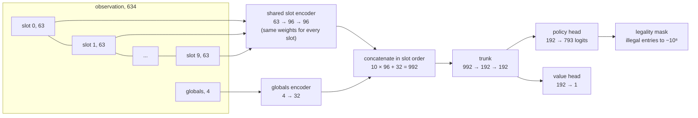
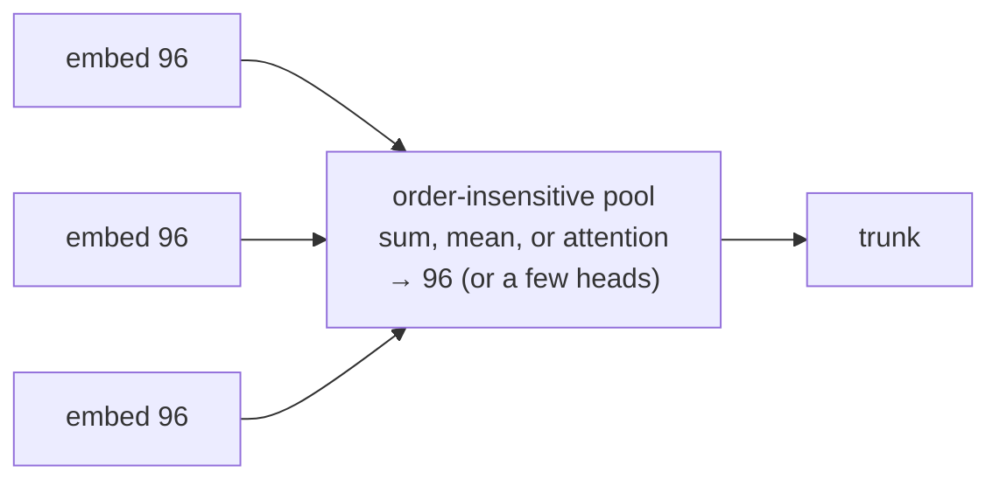

# The policy network, end to end

The owner asked for the full picture in one place, because the pooling-against-concatenation question is meaningless without it. This page walks the exact tensor path from the worker's JSON to the 793 logits, then shows where the slot lifecycle creates the problem that pooling would remove. The implementation is `python/fheroes2_agent/policy.py` consuming `encoding.py`; widths here are quoted from code, and [[training-design#As built, 2026-08-05|training-design]] carries the capacity measurements behind them.

For the runtime view of this same network, one real decision followed from engine JSON through the forward pass to the chosen action, read [[../implementation/inference-walkthrough]] beside this page.

## From battle to tensor

A battle state arrives as up to ten living stacks plus four battle-level scalars. The encoder lays them out as ten fixed slots of 63 features each, 630 numbers, then the 4 globals, 634 in total (`obs_encoding_v3`).

Each slot's 63 features are: presence and side flags, the active-turn flag, counts (current, initial, fraction), hit points (stack total and the damaged top creature), the six stat fields (attack, defense, speed, shots, morale, luck), position (row, column, cell), four ability flags (wide, flying, archer, hand-fighting), and a 41-way creature one-hot. An empty slot is all zeros with the presence flag off.

Slots are filled in the engine's unit order, own side and enemy side mixed, living stacks only. That last clause is the load-bearing one and the section below returns to it.

## The network, layer by layer

One two-layer perceptron, 63 to 96 to 96, embeds every slot with the same weights, which is what makes a stack's meaning come from its features rather than from which slot happens to hold it, at the embedding stage. The ten 96-wide embeddings are then concatenated in slot order into a 960-wide block, the encoded globals append 32 more, and a two-layer 192-wide trunk feeds both heads. 396,570 parameters in total. The policy head's 793 logits are masked to the legal actions ([[../implementation/legal-actions-and-masking]]) and softmaxed.

## Where the slot lifecycle bites

The concatenation step undoes half of what the shared encoder bought. Because slots hold living stacks in engine order, a death shifts every later stack down one slot, and concatenation wires each slot to a fixed range of trunk inputs.

Consider three own stacks A, B, C in slots 0, 1, 2, with C a Champion whose embedding feeds trunk inputs 192 through 287. B dies. Now C sits in slot 1 and the same Champion, same cell, same counts, feeds inputs 96 through 191 instead. To the trunk these are different input coordinates, so every fact it has learned about "the Champion pattern at slot 2" must be relearned at slot 1, and at slot 0, and for every arrangement deaths can produce. The trunk must spend capacity learning that ten copies of the same pattern mean the same thing, a permutation invariance the architecture could simply grant.

## What pooling would change

A pooled aggregation, summing or averaging the ten embeddings, or attending over them, produces the same output under any slot permutation, so a death changes nothing but the dead stack's absence. The invariance arrives by construction instead of by training data.

The cost is what concatenation was chosen for at ten slots: a concatenated trunk can, in principle, represent relations between specific stacks ("my slot-2 archer versus their slot-7 flyer") that a plain sum collapses; attention pooling recovers that expressiveness at the price of more machinery. [[training-design#The policy network|The original design]] chose concatenation as the simplest thing that could work and named mean or attention pooling the fallback, so this was always a deferred experiment rather than a settled conviction.

## Why it is the live suspect

Three measured symptoms fit the diagnosis. Held-out transfer on the fully diverse pool collapsed to $+0.007 \pm 0.046$ where the training split gained $+0.173 \pm 0.039$. The count-extrapolation ablation lost a third of its agreement above the training range under every encoding, so the encoding was not the axis. And the supervised plateau of 2026-08-06, five label arms all trading axes at a fixed network, is what capacity spent on relearnable invariances would look like. None of the three is proof, which is exactly why pooling-against-concatenation is the recorded experiment rather than an adopted change: same corpus, same battery, one axis moved.

## The planes arm, built after this page's first draft

`BattlePolicy(planes=True)` now exists: two 3-by-3 convolutions at 32 channels over the (7, 9, 11) tensor of [[../implementation/observation-design#The planes, built across 2026-08-06 and 07|encode_planes]], no downsampling, squeezed to 128 and concatenated into the trunk beside the slots and globals, about 441k extra parameters, with `load_policy` inferring the arm from the state dict. The three-seed capacity-controlled ablation found its fidelity gain real (agreement 0.897 against the width control's 0.875) and its play gains modest; [[../archive/experiments/2026-08-07-overnight-champion-mixture]] carries the champion-mixture measurement. The pooling question above is unchanged by any of this, since the slot lifecycle bites the entity half either way.

## The experiment, when it runs

Swap the concatenation for mean pooling first (cheapest, most invariant), then attention if the mean collapses needed distinctions. Everything else stays fixed: corpus, losses, battery, multi-seed gate per the experiments README conventions. The battery columns that should move if the diagnosis is right are held-out transfer and count extrapolation; the ladder should hold. A trade, ladder down for transfer up, would say stack-specific relations were load-bearing after all, and attention is the next arm.
